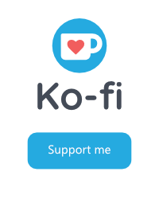

# Tenancy for Laravel

[](https://packagist.org/packages/michaelnabil230/laravel-multi-tenancy)
[](https://github.com/michaelnabil230/laravel-multi-tenancy/actions?query=workflow%3Arun-tests+branch%3Amain)
[](https://github.com/michaelnabil230/laravel-multi-tenancy/actions?query=workflow%3A"Fix+PHP+code+style+issues"+branch%3Amain)
[](https://packagist.org/packages/michaelnabil230/laravel-multi-tenancy)

This is where your description should go. Limit it to a paragraph or two. Consider adding a small example.

## Installation

You can install the package via composer:

```bash
composer require michaelnabil230/laravel-multi-tenancy
```

You can publish and run the migrations with:

```bash
php artisan multi-tenancy:install
```

This is the contents of the published config file:

```php

use MichaelNabil230\MultiTenancy\Events;
use MichaelNabil230\MultiTenancy\Listeners;

return [

    /**
     * NameServer of the server for ex:'ns1.contabo.net'.
     */
    'name_server' => null,

    /**
     * The list of domains hosting your central app.
     *
     * Only relevant if you're using the domain or subdomain identification middleware.
     */
    'central_domains' => [
        '127.0.0.1',
        'localhost',
    ],

    /*
     * These fields are used by tenant:artisan command to match one or more tenant
     */
    'artisan_search_fields' => [
        'id',
    ],

    /**
     * All events for tenancy
     */
    'events' => [
        // Tenant events
        Events\Tenant\CreatingTenant::class => [],
        Events\Tenant\TenantCreated::class => [
            Listeners\SeedDatabase::class,
        ],
        Events\Tenant\SavingTenant::class => [],
        Events\Tenant\TenantSaved::class => [],
        Events\Tenant\UpdatingTenant::class => [],
        Events\Tenant\TenantUpdated::class => [],
        Events\Tenant\DeletingTenant::class => [],
        Events\Tenant\TenantDeleted::class => [],

        // Domain events
        Events\Domain\CreatingDomain::class => [],
        Events\Domain\DomainCreated::class => [],
        Events\Domain\SavingDomain::class => [],
        Events\Domain\DomainSaved::class => [],
        Events\Domain\UpdatingDomain::class => [],
        Events\Domain\DomainUpdated::class => [],
        Events\Domain\DeletingDomain::class => [],
        Events\Domain\DomainDeleted::class => [],

        // DataBase events 
        Events\DataBase\SeedingDatabase::class => [],
        Events\DataBase\DatabaseSeeded::class => [],

        // Tenancy events
        Events\Tenancy\InitializingTenancy::class => [],
        Events\Tenancy\TenancyInitialized::class => [
            Listeners\BootstrapTenancy::class,
        ],
        Events\Tenancy\EndingTenancy::class => [],
        Events\Tenancy\TenancyEnded::class => [
            Listeners\RevertToCentralContext::class,
        ],

        Events\Tenancy\BootstrappingTenancy::class => [],
        Events\Tenancy\TenancyBootstrapped::class => [],
        Events\RevertingToCentralContext::class => [],
        Events\RevertedToCentralContext::class => [],
    ],

    /**
     * Tenancy bootstrappers are executed when the tenancy is initialized.
     * Their responsibility is making Laravel features tenant-aware.
     *
     * To configure their behavior, see the config keys below.
     */
    'bootstrappers' => [
        MichaelNabil230\MultiTenancy\Bootstrappers\CacheTenancyBootstrapper::class,
        MichaelNabil230\MultiTenancy\Bootstrappers\FilesystemTenancyBootstrapper::class,
        MichaelNabil230\MultiTenancy\Bootstrappers\QueueTenancyBootstrapper::class,
        // MichaelNabil230\MultiTenancy\Bootstrappers\RedisTenancyBootstrapper::class, // Note: phpredis is needed
    ],

    /**
     * Redis tenancy config. Used by RedisTenancyBootstrapper.
     *
     * Note: You need phpredis to use Redis tenancy.
     *
     * Note: You don't need to use this if you're using Redis only for the cache.
     * Redis tenancy is only relevant if you're making direct Redis calls,
     * either using the Redis facade or injecting it as a dependency.
     */
    'redis' => [
        'prefix_base' => 'tenant', // Each key in Redis will be prepended by this prefix_base, followed by the tenant id.
        'prefixed_connections' => [ // Redis connections whose keys are prefixed, to separate one tenant's keys from another.
            // 'default',
        ],
    ],

    /**
     * Cache tenancy config. Used by CacheTenancyBootstrapper.
     *
     * This works for all Cache facade calls, cache() helper
     * calls and direct calls to injected cache stores.
     */
    'cache_prefix_key' => 'tenant_id_',

    /**
     * The session key Middleware in `ScopeSessions`
     */
    'session_key' => 'ensure_valid_tenant_session_tenant_id',

    /**
     * Filesystem tenancy config. Used by FilesystemTenancyBootstrapper.
     */
    'filesystem' => [
        /**
         * Each disk listed in the 'disks' array will be suffixed by the suffix_base, followed by the tenant_id.
         */
        'suffix_base' => 'tenant',
        'disks' => [
            'local',
            'public',
            // 's3',
        ],

        /**
         * Use this for local disks.
         */
        'root_override' => [
            // Disks whose roots should be override after storage_path() is suffixed.
            'local' => '%storage_path%/app/',
            'public' => '%storage_path%/app/public/',
        ],

        /**
         * Should storage_path() be suffixed.
         *
         * Note: Disabling this will likely break local disk tenancy. Only disable this if you're using an external file storage service like S3.
         *
         * For the vast majority of applications, this feature should be enabled. But in some
         * edge cases, it can cause issues (like using Passport with Vapor - see #196), so
         * you may want to disable this if you are experiencing these edge case issues.
         */
        'suffix_storage_path' => true,

        /**
         * By default, asset() calls are made multi-tenant too. You can use mix()
         * for global, non-tenant-specific assets. However, you might have some issues when using
         * packages that use asset() calls inside the tenant app. To avoid such issues, you can
         * disable asset() helper tenancy and explicitly use tenant_asset() calls in places
         * where you want to use tenant-specific assets (product images, avatars, etc).
         */
        'asset_helper_tenancy' => true,
    ],

    /**
     * Features are classes that provide additional functionality
     * not needed for the tenancy to be bootstrapped. They are run
     * regardless of whether the tenancy has been initialized.
     *
     * See the documentation page for each class to
     * understand which ones you want to enable.
     */
    'features' => [
        // MichaelNabil230\MultiTenancy\Features\TelescopeTags::class,
        // MichaelNabil230\MultiTenancy\Features\TenantSetting::class,
    ],

    /**
     * Parameters used by the db:seed command.
     */
    'seeder_parameters' => [
        '--class' => 'TenantDatabaseSeeder',
        '--force' => true,
    ],

    /**
     * Subscription for Tenant
     */
    'subscription' => [
        /**
         * Enable if you need tenant has subscription in your application
         */
        'enable' => false,

        /**
         * Route for the subscription index
         */
        'route' => null,

        /**
         * All events for subscription
         */
        'events' => [
            // Subscription events
            Events\Subscription\SubscriptionCreated::class => [],
            Events\Subscription\SubscriptionUpdated::class => [],
            Events\Subscription\SubscriptionCancelled::class => [],
            Events\Subscription\SubscriptionChangePlan::class => [],
            Events\Subscription\SubscriptionRenewed::class => [],
            Events\Subscription\SubscriptionResume::class => [],
        ],
    ],
];
```

# Configuration

The package is highly configurable. This page covers what you can configure in the `config/multi-tenancy.php` file, but note that many more things are configurable. Some things can be changed by extending classes (e.g. the `Tenant` model), and **many** things can be changed using static properties. These things will *usually* be mentioned on the respective pages of the documentation, but not every time. For this reason, don't be afraid to dive into the package's source code — whenever the class you're using has a `public static` property, **it's intended to be configured**.

## Static properties

You can set static properties like this (example):

```php
\MichaelNabil230\MultiTenancy\MultiTenancy::$onFail = function () {
    return redirect('https://my-central-domain.com/');
};
```

A good place to put these calls is your `app/Providers/TenancyServiceProvider`'s `boot()` method.

### Tenant model

```php
MultiTenancy::tenant();

// Can be change with the pass model name.
MultiTenancy::useTenantModel(Model::class);
```

This config specifies what `Tenant` model should be used by the package. There's a high chance you're using a custom model, 
as instructed to by the [Tenants], so be sure to change it in the config.

### Domain model

```php
MultiTenancy::domain();

// Can be change with the pass model name.
MultiTenancy::useDomainModel(Model::class);
```

Similar to the Tenant model config. If you're using a custom model for domains, change it in this config. If you're not using domains (e.g. if you're using path or request data identification) at all, ignore this config key altogether.

### Central domains

`multi-tenancy.central_domains`

The list of domains that host your [central app]. This is used by (among other things):

- the `InitializeTenancyBySubdomain` middleware, to check whether the current hostname is a subdomain on one of your central domains.

### Bootstrappers

`multi-tenancy.bootstrappers`

This config array lets you enable, disable or add your own [tenancy bootstrappers]

### Cache

`multi-tenancy.cache.*`

This section is relevant to cache separation, specifically, to the `CacheTenancyBootstrapper`.

Note: To use the cache separation, you need to use a cache store that supports tagging, which is usually Redis.

See this section in the config, it's documented with comments.

### Filesystem

`multi-tenancy.filesystem.*`

This section is relevant to storage separation, specifically, to the `FilesystemTenancyBootstrapper`.

See this section in the config, it's documented with comments.

### Redis

`multi-tenancy.redis.*`

This section is relevant to Redis data separation, specifically, to the `RedisTenancyBootstrapper`.

Note: To use the this bootstrapper, you need phpredis.

See this section in the config, it's documented with comments.

### Features

`multi-tenancy.features`

This config array lets you enable, disable or add your own [feature classes]

### Seeder parameters

`multi-tenancy.seeder_parameters`

The same as migration parameters, but for `tenants:seed` and the `SeedDatabase` job.

# Event system

This package is heavily based around events, which makes it incredibly flexible.

By default, the events are configured in such a way that the package works like this:

- A request comes in for a tenant route and hits an identification middleware
- The identification middleware finds the correct tenant and runs

```php
$this->tenancy->initialize($tenant);
```

- The `MichaelNabil230\MultiTenancy\Tenancy` class sets the `$tenant` as the current tenant and fires a `TenancyInitialized` event
- The `BootstrapTenancy` class catches the event and executes classes known as [tenancy bootstrappers].
- The tenancy bootstrappers make changes to the application to make it "scoped" to the current tenant. This by default includes:
    - Switching the database connection
    - Suffixing filesystem paths
    - Making queues store the tenant id & initialize tenancy when being processed

Again, all of the above is configurable. You might even disable all tenancy bootstrappers, and just use tenant identification and scope your app manually around the tenant stored in `MichaelNabil230\MultiTenancy\Tenancy`. The choice is yours.

# TenancyServiceProvider

This package comes with a very convenient service provider that's added to your application when you install the package. This service provider is used for mapping listeners to events specific to the package and is the place where you should put any tenancy-specific service container calls — to not pollute your AppServiceProvider.

Note that you can register listeners to this package's events **anywhere you want**. The event/listener mapping in the service provider exists only to make your life easier. If you want to register the listeners manually, like in the example below, you can.

```php
Event::listen(TenancyInitialized::class, BootstrapTenancy::class);
```

# Bootstrapping tenancy

By default, the `BootstrapTenancy` class is listening to the `TenancyInitialized` event (exactly as you can see in the example above). That listener will execute the configured tenancy bootstrappers to transition the application into the tenant's context. You can read more about this on the [tenancy bootstrappers]

Conversely, when the `TenancyEnded` event fires, the `RevertToCentralContext` event transitions the app back into the central context.

# Available events

Note: Some database events (`SeedingDatabase`, `DatabaseSeeded` and possibly others) are **fired in the tenant context.** Depending on how your application bootstraps tenancy, you might need to be specific about interacting with the central database in these events' listeners — that is, if you need to.

Note: All events are located in the `MichaelNabil230\MultiTenancy\Events` namespace.

### **Tenancy** 

- `InitializingTenancy`
- `TenancyInitialized`
- `EndingTenancy`
- `TenancyEnded`
- `BootstrappingTenancy`
- `TenancyBootstrapped`
- `RevertingToCentralContext`
- `RevertedToCentralContext`

Note the difference between *initializing tenancy and bootstrapping* tenancy. Tenancy is initialized when a tenant is loaded into the `Tenancy` object. Whereas bootstrapping happens **as a result of initialization** — if you're using automatic tenancy, the `BootstrapTenancy` class is listening to the `TenancyInitialized` event and after it's done executing bootstrappers, it fires an event saying that tenancy was bootstrapped. You want to use the bootstrapped event if you want to execute something **after the app has been transitioned to the tenant context.**

### Tenant 

The following events are dispatched as a result of Eloquent events being fired in the default `Tenant` implementation (the most often used events are bold):

- `CreatingTenant`
- `TenantCreated`
- `SavingTenant`
- `TenantSaved`
- `UpdatingTenant`
- `TenantUpdated`
- `DeletingTenant`
- `TenantDeleted`

### Domain 

These events are optional. They're only relevant to you if you're using domains for your tenants.

- `CreatingDomain`
- `DomainCreated`
- `SavingDomain`
- `DomainSaved`
- `UpdatingDomain`
- `DomainUpdated`
- `DeletingDomain`
- `DomainDeleted`

### Database

These events are also optional. They're relevant to you if you're using multi-database tenancy:

- `SeedingDatabase`
- `DatabaseSeeded`

## Tenant routes

You may register tenant routes in `routes/tenant.php`. These routes have no middleware applied on them, and their controller namespace is specified in `app/Providers/TenancyServiceProvider`.

By default, you will see the following setup:

```php
Route::middleware([
    'web',
    InitializeTenancyByDomain::class,
])->group(function () {
    Route::get('/', function () {
        return 'This is your multi-tenant application. The id of the current tenant is ' . tenant('id');
    });
});
```

Routes within this group will have the `web` middleware group, an initialization middleware, and finally, a middleware related to the section below applied on them.

You may do the same for the `api` route group, for instance.

Also, you may use different initialization middleware than the domain one. For a full list, see the [Tenant identification].

# Concepts

In single-database tenancy, there are 4 types of models:

- your **Tenant** model
- primary models — models that **directly** belongTo tenants
- secondary models — models that **indirectly** belongTo tenants
    - e.g. **Comment** belongsTo **Post** belongsTo **Tenant**
    - or more complex, **Vote** belongsTo **Comment** belongsTo **Post** belongsTo **Tenant**
- global models — models that are **not scoped** to any tenant whatsoever

To scope your queries correctly, apply the `MichaelNabil230\MultiTenancy\Traits\BelongsToTenant` trait **on primary models**. This will ensure that all calls to your parent models are scoped to the current tenant, and that **calls to their child relations are scoped through the parent relationships**.

And that's it. Your models are now automatically scoped to the current tenant, and not scoped at all when there's no current tenant (e.g. in a central admin panel).

However, there's one edge case to keep in mind. Consider the following set-up:

```php
class Post extends Model
{
    use BelongsToTenant;

    public function comments()
    {
        return $this->hasMany(Comment::class);
    }
}

class Comment extends Model
{
    public function post()
    {
        return $this->belongsTo(Post::class);
    }
}
```

Looks correct, but you might still accidentally access another tenant's comments.

If you use this:

```php
Comment::all();
```

then the model has no way of knowing how to scope that query, since it doesn't directly belong to the tenant. Also note that in practice, you really shouldn't be doing this much. You should ideally access secondary models through parent models in every single case.

However, sometimes you might have a use case where you **really need to do that** in the tenant context. For that reason, we also provide you with a `BelongsToPrimaryModel` trait, which lets you scope calls like the one above to the current tenant, by loading the parent relationship — which gets automatically scoped to the current tenant — on them.

So, to give you an example, you would do this:

```php
class Comment extends Model
{
	use BelongsToPrimaryModel;

    public function getRelationshipToPrimaryModel(): string
    {
        return 'post';
    }

    public function post()
    {
        return $this->belongsTo(Post::class);
    }
}
```

And this will automatically scope the `Comment::all()` call to the current tenant. Note that the limitation of this is that you **need to be able to define a relationship to a primary model**, so if you need to do this on the "Vote" in ***Vote** belongsTo **Comment** belongsTo **Post** belongsTo **Tenant**,* you need to define some strange relationship. Laravel supports `HasOneThrough`, but not `BelongsToThrough`, so you'd need to do some hacks around that. For that reason, I recommend avoiding these `Comment::all()`-type queries altogether.

# Database considerations

### Unique indexes 

If you'd have a unique index such as:

```php
$table->unique('slug');
```

in a standard non-tenant, or multi-database-tenant, application, you need to scope this unique index to the tenant, meaning you'd do **this on primary models:**

```php
$table->unique(['tenant_id', 'slug']);
```

and this on **secondary models:**

```php
// Imagine we're in a 'comments' table migration

$table->unique(['post_id', 'user_id']);
```

### Validation 

The `unique` and `exists` validation rules of course aren't scoped to the current tenant, so you need to scope them manually like this:

```php
Rule::unique('posts', 'slug')->where('tenant_id', tenant('id'));
```

You'll be able to use these two methods:

```php
// You may retrieve the current tenant using the tenant() helper.
// $tenant = tenant();

$rules = [
    'id' => $tenant->exists('posts'),
    'slug' => $tenant->unique('posts'),
]
```

### Low-level database queries 

And the final thing to keep in mind is that `DB` facade calls, or any other types of direct database queries, of course won't be scoped to the current tenant.

The package can only provide scoping logic for the abstraction logic that Eloquent is, it can't do anything with low level database queries.

Be careful with using them.

### Making Artisan command tenant aware

Commands can be made tenant aware by applying the `TenantAware` trait. When using the trait it is required to append `{--tenant=*}` or `{--tenant=}` to the command signature.

Caution: If you append `{--tenant=*}`, then if no `tenant` option is provided when executing the command, the command will execute for *all* tenants.
 
```php
use Illuminate\Console\Command;
use MichaelNabil230\MultiTenancy\Commands\Concerns\TenantAware;

class YourFavoriteCommand extends Command
{
    use TenantAware;

    protected $name = 'your-favorite-command';

    public function handle()
    {
        return $this->line('The tenant is '. Tenant::current()->name);
    }
}
```

When executing the command, the `handle` method will be called for each tenant. 

```bash
php artisan your-favorite-command 
```

Using the example above, the name of each tenant will be written to the output of the command.


You can also execute the command for a specific tenant:


```bash
php artisan your-favorite-command --tenant=1
```

### Running artisan command for seed data to tenant

Can it run a seed command to a specific tenant or for all tenants with the same previous section

```bash
php artisan tenants:seed --tenant=123
```

### Running artisan command for create a new tenant

Can it run a create command to quickly create a tenant

```bash
php artisan create:tenant shop-1
```

## Making global queries 

To disable the tenant scope, simply add `withoutTenancy()` to your query.

## The subscription section

That's it, we only have to use that trait in our User model! Now your users may subscribe to plans.

### Create a Plan

```php
use MichaelNabil230\MultiTenancy\MultiTenancy;

$plan = MultiTenancy::plan()->create([
    'name' => 'Pro',
    'description' => 'Pro plan',
    'price' => 9.99,
    'invoice_period' => 1,
    'invoice_interval' => 'month',
    'trial_period' => 15,
    'trial_interval' => 'day',
]);

// Create multiple plan features at once
$plan->features()->saveMany([
    new Feature(['name' => 'listings']),
    new Feature(['name' => 'pictures_per_listing']),
    new Feature(['name' => 'listing_duration_days', 'resettable_period' => 1, 'resettable_interval' => 'month']),
    new Feature(['name' => 'listing_title_bold'])
]);
```

### Getting all plans

Get all plans with sections and features:

```php
$plans = MultiTenancy::plans();
```

### Get Plan Details

You can query the plan for further details, using the intuitive API as follows:

```php
$plan = MultiTenancy::plan()->find(1);

// Get all plan features                
$plan->features;

// Get all plan subscriptions
$plan->subscriptions;

// Check if the plan is free
$plan->isFree();

// Check if the plan has trial period
$plan->hasTrial();
```

Both `$plan->features` and `$plan->subscriptions` are collections, driven from relationships, and thus you can query these relations as any normal Eloquent relationship. E.g. `$plan->features()->where('name', 'listing_title_bold')->first()`.

### Create a Subscription

You can subscribe a tenant to a plan by using the `createSubscription(Plan $plan, Carbon $startDate = null)` function available in the `Tenant` model. First, 
retrieve an instance of your subscriber model, which typically will be your tenant model and an instance of the plan your tenant is subscribing to. Once you have retrieved the model instance, you may use the `createSubscription` method to create the model's subscription.

```php
$tenant = MultiTenancy::tenant()->find(1);
$plan = MultiTenancy::plan()->find(1);

$tenant->createSubscription($plan, Carbon::now()->addMonths(4));
```

The first argument passed to `createSubscription` while the argument is the plan instance your tenant is subscribing to, and there's an optional second parameter to specify custom start date as an instance of `Illuminate\Support\Carbon` (by default if not provided, it will start now).

### Change the Plan

You can change subscription plan easily as follows:

```php
$plan = MultiTenancy::plan()->find(2);
$subscription = MultiTenancy::subscription()->find(1);

// Change subscription plan
$subscription->changePlan($plan);
```

If both plans (current and new plan) have the same billing frequency (e.g., `invoice_period` and `invoice_interval`) the subscription will retain the same billing dates. If the plans don't have the same billing frequency, the subscription will have the new plan billing frequency, starting on the day of the change and the subscription usage data will be cleared. Also if the new plan has a trial period and it's a new subscription, the trial period will be applied.

### Check Subscription Status

For a subscription to be considered active one of the following must be `true`:

- Subscription has an active trial.
- Subscription `ends_at` is in the future.

```php
$user->subscribed($planId);
```

Alternatively you can use the following methods available in the subscription model:

```php
$user->subscription($planId)->active();
$user->subscription($planId)->canceled();
$user->subscription($planId)->ended();
$user->subscription($planId)->onTrial();
```

> Canceled subscriptions with an active trial or `ends_at` in the future are considered active.

### Renew a Subscription

To renew a subscription you may use the `renew` method available in the subscription model. This will set a new `ends_at` date based on the selected plan and _will clear the usage data_ of the subscription.

```php
$user->subscription($planId)->renew();
```

_Canceled subscriptions with an ended period can't be renewed._

### Cancel a Subscription

To cancel a subscription, simply use the `cancel` method on the user's subscription:

```php
$user->subscription($planId)->cancel();
```

### Scopes

#### Subscription Model

```php
// Get subscriptions by plan
$subscriptions = MultiTenancy::subscription()->planId($planId)->get();

// Get subscriptions recurring
$subscriptions = MultiTenancy::subscription()->recurring()->get();

// Get subscriptions canceled
$subscriptions = MultiTenancy::subscription()->canceled()->get();

// Get subscriptions not canceled
$subscriptions = MultiTenancy::subscription()->notCanceled()->get();

// Get subscriptions with ended period
$subscriptions = MultiTenancy::subscription()->ended()->get();

// Get subscriptions with on trial period
$subscriptions = MultiTenancy::subscription()->onTrial()->get();

// Get subscriptions with expired trial period
$subscriptions = MultiTenancy::subscription()->expiredTrial()->get();

// Get subscriptions with not on trial
$subscriptions = MultiTenancy::subscription()->notOnTrial()->get();

// Get subscriptions with on grace period
$subscriptions = MultiTenancy::subscription()->onGracePeriod()->get();

// Get subscriptions with not on grace period
$subscriptions = MultiTenancy::subscription()->notOnGracePeriod()->get();
```

### Models

**MultiTenancy Subscriptions** uses 4 models:

```php
MichaelNabil230\MultiTenancy\Models\Plan;
MichaelNabil230\MultiTenancy\Models\Feature;
MichaelNabil230\MultiTenancy\Models\Subscription;
MichaelNabil230\MultiTenancy\Models\Section;
```

## Support

[](https://ko-fi.com/michaelnabil230)[](https://www.buymeacoffee.com/michaelnabil230)[](https://www.paypal.com/paypalme/MichaelNabil23)

## Testing

```bash
composer test
```

## Changelog

Please see [CHANGELOG](CHANGELOG.md) for more information on what has changed recently.

## Contributing

Please see [CONTRIBUTING](CONTRIBUTING.md) for details.

## Security Vulnerabilities

Please review [our security policy](../../security/policy) on how to report security vulnerabilities.

## Credits

- [Michael Nabil](https://github.com/MichaelNabil230)
- [All Contributors](../../contributors)

## License

The MIT License (MIT). Please see [License File](LICENSE.md) for more information.
